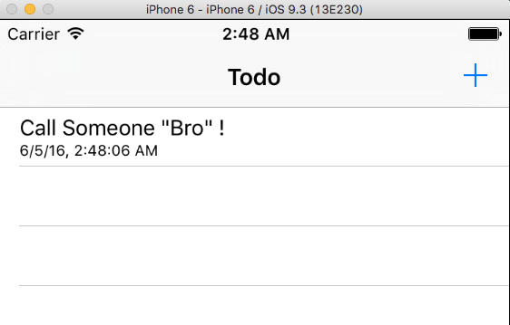
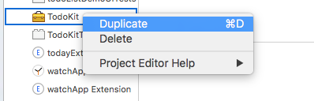
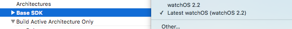
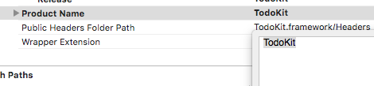
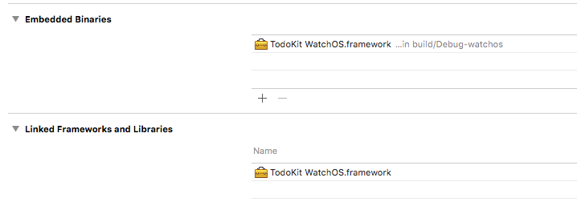

This repository is a simple todo list application for iOS. It was written to demonstrate how taken away unnecessary responsibility of a view controller can enable us to 

1. Write unit test about the core business logic ( enable us to do TDD )
2. Write UI test that does not require re-construct the whole UI state
3. Reuse the business logic code on Today Extension and WatchOS as a framework
4. Easily test the application state such as network connection failure 

Please see the repo history for step by step notes

*Notes for creating a shared iOS/WatchOS framework*
Step 1 

Step 2 

Step 3 

Step 4 

